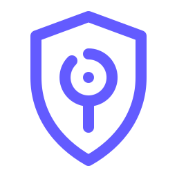

<p align="center">
  
</p>

<h1 align="center">Aegis</h1>

<p align="center">
  <strong>Authentication and authorization for Helios.</strong><br />
  Helios 的统一认证与授权服务。
</p>

## Overview / 项目简介

Aegis owns OAuth 2.1 flows, identity-provider orchestration, MFA and WebAuthn challenges, token issuance, sessions, and relationship-based access checks.

Aegis 负责 Helios 的 OAuth 2.1 流程、身份提供方编排、MFA 与 WebAuthn 挑战、令牌签发、会话和关系型访问控制。持久化身份数据及 Hermes gRPC Schema 由 Hermes 管理。

## Run locally

Aegis needs Redis and a running Hermes instance:

```bash
cp example.toml config.toml
make run
```

The HTTP server listens on port `18000` by default.

## Hermes client bindings

Aegis keeps its generated Go client bindings private under `internal/rpc/hermes/v1`. The language-neutral Schema is published by [Hermes](https://github.com/heliantheon/hermes) with independent `schema/*` tags.

```bash
make generate
make check-generate
```

Normal builds use the committed generated files and do not require Buf or network access.

## Development

```bash
make test
make lint
make build
```

Design notes live in [`docs/`](docs/). Shared client and guard code is maintained in [`aegis-go`](https://github.com/heliantheon/aegis-go).
