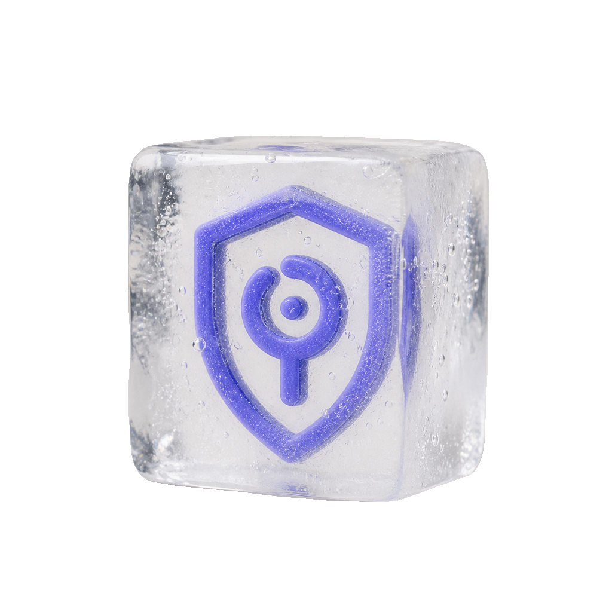

  

<h1 align="center">Aegis</h1>

Aegis 是账号与权限中枢。用户登录、令牌签发、会话管理、MFA 和 WebAuthn 挑战，以及「谁能不能访问谁」的关系判断，都归它管。它自己不留身份数据——那部分存在 Hermes——Aegis 只负责把认证这套流程跑起来：OAuth 2.1 授权码、多身份提供方的编排、令牌生命周期。

Aegis is the authentication and authorization service: login, token issuance, sessions, MFA and WebAuthn challenges, and relationship-based access checks. It doesn't store identity data — that lives in Hermes — it runs the auth flows themselves: OAuth 2.1, identity-provider orchestration, and the token lifecycle.